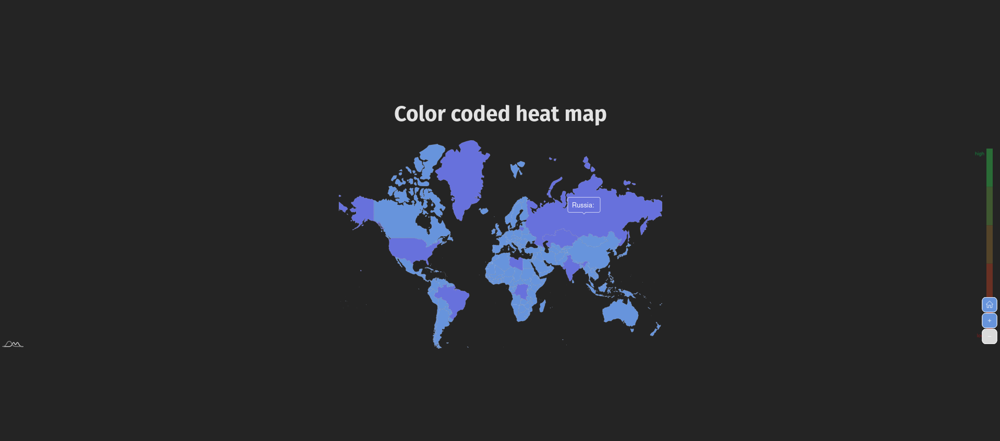

# Geosentiments

This project aims to show an interactive heatmap of sentiments.
The app is build with vue.js and vite

## Available Scripts

In the project directory, you can run:

### `npm dev`

Runs the app in the development mode.\
Open [http://localhost:8080](http://localhost:8080) to view it in the browser.

The page will reload if you make edits.\
You will also see any lint errors in the console.

### `npm run build`

Builds the app for production to the `build` folder.\
It correctly bundles React in production mode and optimizes the build for the best performance.

The build is minified and the filenames include the hashes.\
Your app is ready to be deployed!

### `docker run -p 8080:8080 <image_tag>`

Renders the application when the user queries this URL in their browser: http://127.0.0.1:8080
